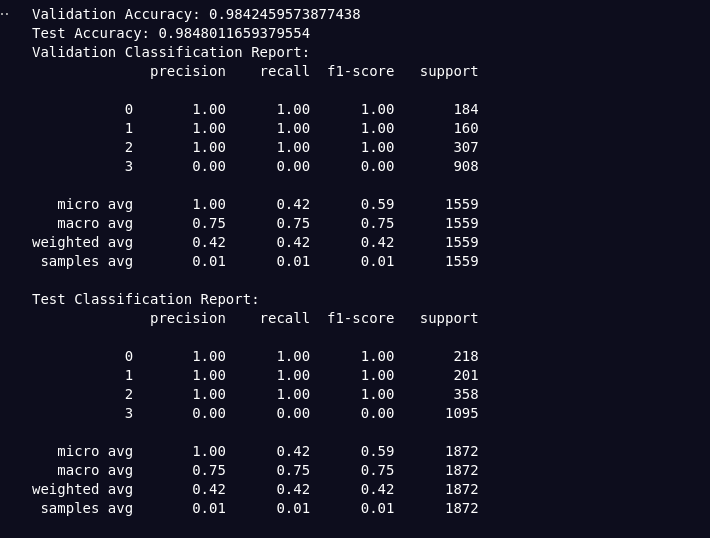

# Multi-Label Classification Intelligent Fault Detection:

**Detection and Identification of Simultaneous Known and Unknown Faults in Automotive Software Systems Based on HIL**

## Overview

This project focuses on a multi-label classification problem involving the prediction of four different classes: `delay_class`, `gain_class`, `noise_class`, and `loss_class`. The goal is to train and evaluate separate models for each class using logistic regression, handle missing values in the dataset, and provide detailed evaluation metrics for each model.

#### Data Used:

- Training data from HIL (Hardware-In-The-Loop) values.
- File paths for training data:
  - './HIL Data 062024/ACC faults different scenarios/Sc5Healthy.csv'
  - './HIL Data 062024/ACC faults different scenarios/Sc5DelayAPP.csv'
  - './HIL Data 062024/ACC faults different scenarios/SC5GainAPP.csv'
  - './HIL Data 062024/ACC faults different scenarios/Sc5NoiseAPP.csv'
  - './HIL Data 062024/ACC faults different scenarios/Sc5PacketLossAPP.csv'
- Data from scenarios SC4, SC3, and SC2 is also available but not used for training.

#### Advantages of Using Simple Logistic Regression Over GRU:

1. **Simplicity and Interpretability**:

   - **Logistic Regression**: Logistic regression is a simple and interpretable model. It provides clear insights into how each feature influences the prediction, which is crucial for understanding and diagnosing faults in automotive systems.
   - **GRU**: Gated Recurrent Units (GRUs) are complex models that can capture temporal dependencies but are harder to interpret. For automotive fault detection, interpretability is key for identifying the root cause of issues.

2. **Computational Efficiency**:

   - **Logistic Regression**: Training logistic regression models is computationally efficient and requires less time and resources compared to training GRU models. This makes logistic regression more suitable for real-time fault detection and identification in automotive systems.
   - **GRU**: GRUs are computationally intensive due to their recurrent nature and require more training time and computational power. This can be a limitation in environments where quick detection and response are essential.

3. **Handling Missing Data**:

   - **Logistic Regression**: Logistic regression can be effectively combined with imputation techniques to handle missing data, ensuring robust model performance.
   - **GRU**: While GRUs can theoretically handle missing data, the complexity of the model can make it challenging to implement effective imputation strategies, potentially affecting model performance.

4. **Focus on Simultaneous Fault Detection**:

   - **Logistic Regression**: The problem focuses on detecting and identifying multiple faults simultaneously. Logistic regression, with its straightforward approach and ability to be extended to multi-label classification, is well-suited for this task.
   - **GRU**: GRUs are powerful for sequential data but may add unnecessary complexity when the primary goal is to detect simultaneous rather than sequential faults.

5. **Practical Implementation**:
   - **Logistic Regression**: Implementing logistic regression models is straightforward with existing libraries and frameworks, making it easier to integrate into existing automotive diagnostic systems.
   - **GRU**: Implementing and fine-tuning GRU models requires more expertise and effort, which may not be justified given the nature of the problem.

## Data Preparation

### Dataset

The dataset consists of several features and four target variables (labels). The features are stored in the `X` variable, while the labels are stored in the `y_all` DataFrame.

### Handling Missing Values

The dataset contains missing values encoded as NaNs. To handle these missing values, the `SimpleImputer` from `sklearn.impute` is used. The imputer replaces missing values with the mean of the corresponding feature.

## Model Training and Evaluation

### Training

Separate logistic regression models are trained for each class. The steps involved are:

1. **Data Splitting**:

   - The dataset is split into training, validation, and test sets.
   - The split is done separately for each class to ensure that each model is trained on its respective data.

2. **Model Training**:
   - Each logistic regression model is trained using the training set.
   - The trained models are saved using `joblib` for future use.

### Evaluation

Each model is evaluated using the validation and test sets. The evaluation metrics include:

- **Accuracy**: The proportion of correctly predicted instances.
- **Classification Report**: A detailed report showing precision, recall, and F1-score for each class.
- **Confusion Matrix**: A matrix showing the true vs. predicted labels.
- **ROC Curve and AUC**: The Receiver Operating Characteristic curve and the Area Under the Curve to evaluate the performance of the classifier.

## Results

The models were successfully trained and evaluated for each class. The results include accuracy scores, classification reports, confusion matrices, and ROC curves. The trained models were saved and re-evaluated to ensure they were correctly stored and could be loaded for future use.

Classification Report:

#### Conclusion:

For the detection and identification of simultaneous known and unknown faults in automotive software systems based on HIL, logistic regression offers several advantages over GRU models. Its simplicity, interpretability, computational efficiency, and suitability for handling missing data make it an excellent choice for this application. While GRUs are powerful for certain tasks, the specific requirements of this problem make logistic regression the more practical and effective solution.

## Future Work

- Explore other imputation strategies and their impact on model performance.
- Experiment with different classification algorithms such as `HistGradientBoostingClassifier` that can handle missing values natively.
- Perform hyperparameter tuning to optimize the model performance.
- Implement cross-validation to get more reliable estimates of model performance.
